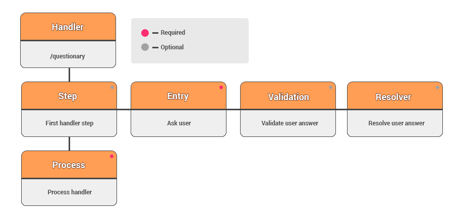

Let’s consider a simple example of the Chat Bot with questioner filling. Example of this [questionary handler](./src/main/resources/handlers/questionary/questionary-dialog.kts).
 
You should make the next step to start a command process with the Chat Bot:
```
handler("/questionary") {
}
```

Now you can write a massage to the Bot `/questionary`, and handler will work.

The first thing executing will begin with is the first described step and its entry block:

```
step<String>("fio") {
    entry { _, _ ->
        TextMessage("Write your name")
    }
}
``` 

You describe an action in the entry block, performed with a command /questionary. In this case we are sending an interrogative message to the user.

**Resolver and validation block aren’t necessary.**  

Please note, you are supposed to mention a type, which returns this `step(<String>)`.
You’ll understand, why we need these later. All I can say, that returnable type may be different. In our case it’s a TelegramMassage, String, because we are using a **resolver block**.

The **resolver block** – it’s a part of code, which allows you somehow to modify a received message from the user after answering on the entry block.  
In this instance, we are getting the user’s message itself in order to not work with the whole structure of the TelegramMessage:  

```
resolver { msg ->
    msg.text!!
}
```

Before calling the **resolver block** (after answering on the entry block) a **validation block** is being called. In the **validation block** you may check user’s messages, if you aren’t satisfied with answers, you are staying on this step, until you won’t get an acceptable message.
 
In our example the **validation block** is checking the user actually did send us a message instead of sending us an image or something else:

```
validation { msg ->
    if (msg.text == null) {
        TextMessage("I asked for name :angry:".emojize())
    } else {
        null
    }
}
```

You could see an opportunity of **emoji**. If you want to use an **emoji**, you should apply an appropriate alias right in the text of the message.
Then call the method `emojize()` for the string. 
After that there are two simple steps: age and rate; which, I suppose, don’t need in any description. 

At last the weightiest block is the **process block**. In this block we are getting **ctx**, from which we can receive answers on the each step we made (`val fio = ctx.answer["fio"] as String`).

As I said earlier, the type, returned by step, is important for us, because only there you can see the differ of returning results:

```
val fio = ctx.answer["fio"] as String
val age = ctx.answer["age"] as TelegramMessage
```

At the end of the **process block** we are answering (not necessarily) to user with the result’s message `TextMessage("Thank you for you answers")`

I’ll show it on the scheme, so you could understand the common flow of the conversation:


